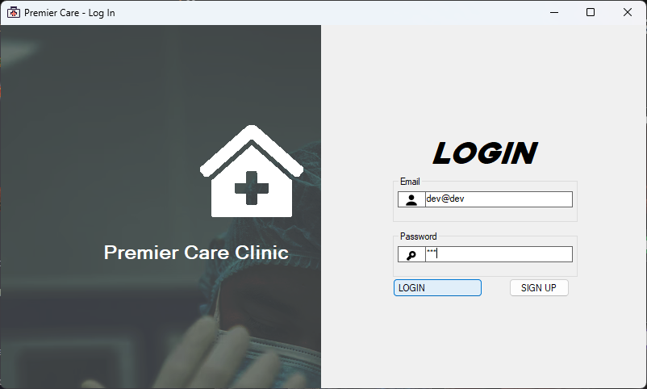
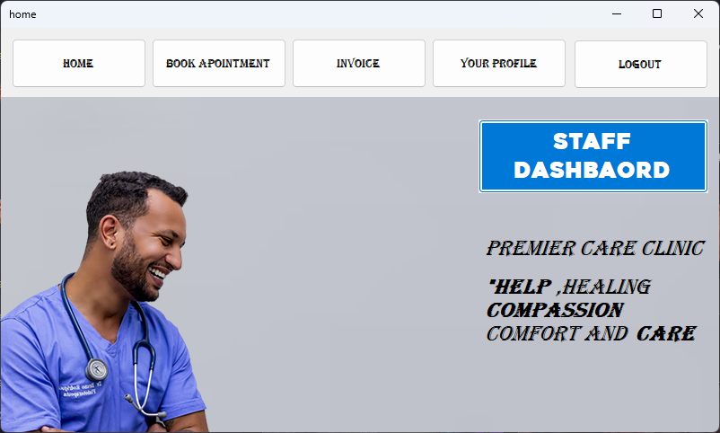
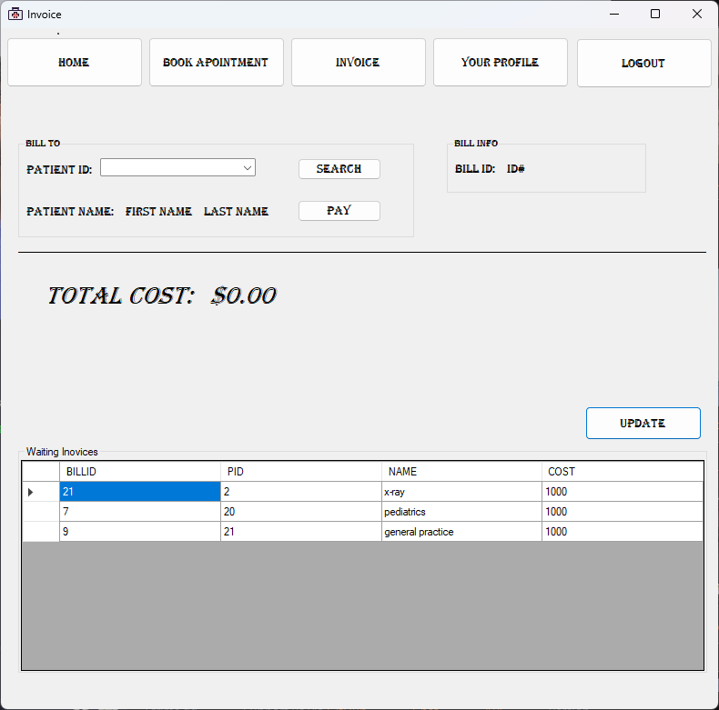
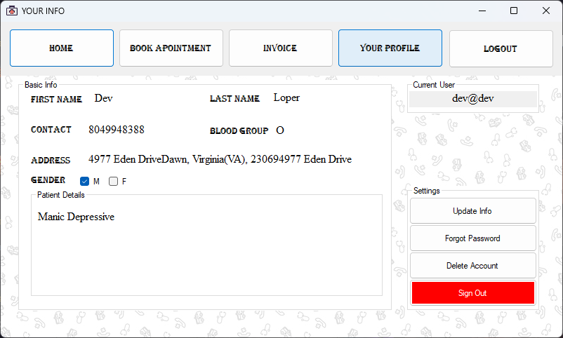
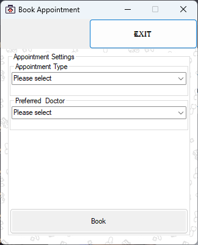
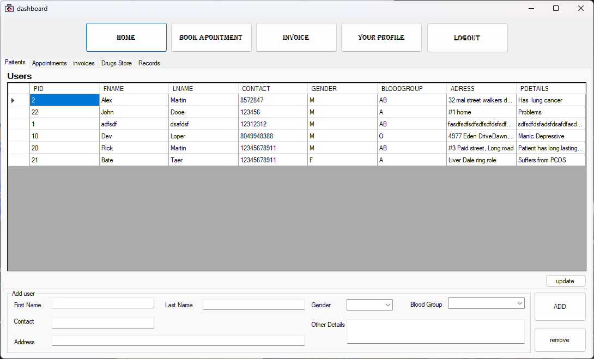

# Semester Project Topic

Please see the following information with the requirements for the semester project.

The Rio Claro Community established the Rio Claro Premier Care Clinic in 2005.  The hospital cares for the health needs of the community. Premier Care needs to develop a software application with a relational database to support their operation.  At this initial stage of their operation, the application must accommodate the following requirements:  

+ Storing patient details, including their name, address, DOB, allergies, blood type, etc. Each patient will have a unique patient number.    
+ A patient can make an appointment to see a doctor on staff. The appointment contains patient information, doctor information, date, time and particulars for the appointment, including which CSR made the appointment.    
+ There are also several nurses, lab and x-ray technicians and therapists on staff whose details need to be recorded.
+ There are six general categories of services a patient may use: pediatrics, general practice, specialist, laboratory, therapy, and x-ray. Each services has a different unit cost  
+ Each patient may be required to take a variety of drugs, a certain number of times per day, and for varying lengths of time. Each drug has a cost associated with it.
+ The system will also need to track a patient’s treatment and it should be capable of calculating the cost of treatment In order to provide itemized billing.    
+ A billing invoice will be generated every visit for the services a customer has used. It provides a detailed list of all services used during the visit.   

## Technology used
 
+ Visual Studio code 2019
+ Sql Developer
+ Oracle Database
 
# How to build
 
+ Database
    - Run run code in system table from `Scheme.sql` -> Connect to `premierch`
    - In premierch run `create.sql` > `inserts.sql`
+ Open `PremierCH_MGMT.sln` with Visual Studio
+ Build
 
# Functions Working
- Log In / Sign up
    - Admin rights
- User Profile
    - Buttons for update / save / remove / reset password `not working` 
- Invoice (staff side only - user locked could be made)
- Book Appointments
- Dashboard
    - Add Patients
    - Add appointments and end it
    - Invoice Waiting list
    - Drug Store (Not working)
    - Records

# Preview

